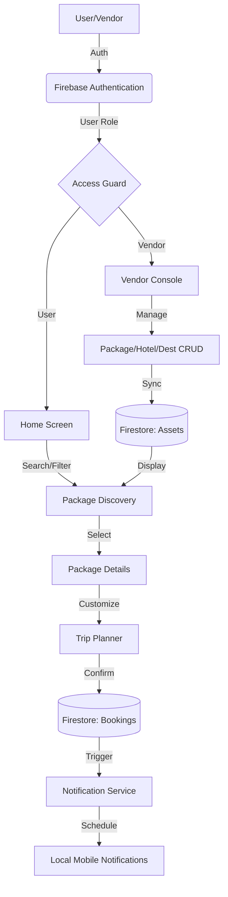

# 🗺️ Roads to go — Premium Trip Planner

**Roads to go** is a state-of-the-art Flutter travel application designed to simplify journey planning through curated itineraries, real-time tracking, and a powerful vendor ecosystem.

---

## ✨ Core Features

### 👤 User Experience
- **Discovery Engine**: Browse high-quality packages categorized by vibes (Adventure, Beach, Cultural, etc.).
- **Smart Itinerary Planner**: Interactive day-by-day planning including hotel selection and destination mapping.
- **Meal Personalization**: Opt-in/out of Breakfast, Lunch, and Dinner with region-specific authentic menus.
- **Progress Tracking**: Visual progress bar on active trips to track itinerary completion.
- **Local Reminders**: Automated notifications 15 minutes before every major activity (Food, Visit, Move).
- **My Bookings**: Comprehensive history of past and upcoming trips with detailed schedule views.

### 💼 Vendor & Admin Console
- **Direct Login**: Vendors are immediately routed to a professional management suite.
- **Overview Dashboard**: Real-time stats on Revenue, Active Packages, and Pending Bookings.
- **India Grand Setup**: One-click population of 14+ Indian cities with 80+ linked records (Hotels, Activities, Dests).
- **Full CRUD Control**: Seamlessly manage Packages, Hotels, Destinations, and Activities.
- **Booking Management**: Track and confirm user bookings in real-time.

---

## 🛠️ Technical Stack
- **Frontend**: Flutter (3.x) with Provider for state management.
- **Backend**: Firebase (Firestore, Auth, Storage).
- **Navigation**: GoRouter with asynchronous auth guards.
- **Notifications**: `flutter_local_notifications` + `timezone` for precision scheduling.
- **Theming**: Custom Dark Mode "Vibe" with premium HSL-tailored colors.

---

## 📈 Data Flow Diagram (DFD)

---

## 🔄 App Working Flow (Step-by-Step)

### 1. The Gateway (Authentication)
- Users sign up or log in via `AuthScreen`.
- **Logic**: The app checks the user role (`isAdmin`, `isVendor`, or regular user).
- **Flow**: Regular users land on `HomeScreen`, while Vendors are redirected straight to `VendorScreen`.

### 2. The Search (Discovery)
- Users browse the `HomeScreen` which pulls live data from the `packages` collection in Firestore.
- Shimmer loading and cached images provide a premium feel.

### 3. The Plan (Customization)
- In `PackageDetailScreen`, users select their trip dates.
- For each day, they can view assigned Hotels and Destinations.
- The **Meal Toggle** allows selecting specific meals (BF, LN, DN) which updates the booking details.

### 4. The Commitment (Booking)
- Clicking "Book Now" creates a `BookingModel` document. 
- The `NotificationService` immediately parses the booking dates and times to schedule local reminders.

### 5. The Journey (Execution)
- Users track their trip in `MyBookingsScreen`.
- A progressive timeline shows "What's Next" based on the current time.
- **Notifications** pop up 15 minutes before scheduled arrival, mealtime, or destination visits.

---

## 🔔 Notification System Details

The app uses a "Smart Proactive Reminder" system:

| Event | Logic | Notification Timing |
| :--- | :--- | :--- |
| **Arrival** | Triggered by `arrivalTime` | 15 mins before |
| **Meals** | If BF, LN, or DN is selected | 08:30 AM, 01:30 PM, 08:30 PM |
| **Discovery** | Triggered by Destination tag | 11:00 AM |
| **Rest** | Triggered by `reachingTime` | 15 mins before |

**Mechanism**:
1. When a booking is confirmed, `scheduleTripReminders()` is called.
2. It generates a unique `baseId` from the `bookingId`.
3. It iterates through every day, calculating `TZDateTime` using the `timezone` package.
4. Notifications are pushed to the system tray even if the app is closed.

---

## 🚀 Getting Started

1. **Install Dependencies**: `flutter pub get`
2. **Firebase Setup**: 
   - Add `google-services.json` (Android) or `GoogleService-Info.plist` (iOS).
   - Enable Email/Password Auth & Firestore.
3. **Run**: `flutter run`

---

## 🇮🇳 India Grand Setup (Bulk Data)
For testing, developers can use the "Build India Itineraries" button in the Vendor Dashboard. This adds:
- **14 Cities**: Delhi, Mumbai, Jaipur, Udaipur, Goa, Agra, Varanasi, Manali, Chennai, Kolkata, Bangalore, Kochi, Shimla, Rishikesh.
- **Multiple Linked Records**: Each city gets 2 Hotels, 2 Destinations, and 2 Activities linked to 1 primary Package.
